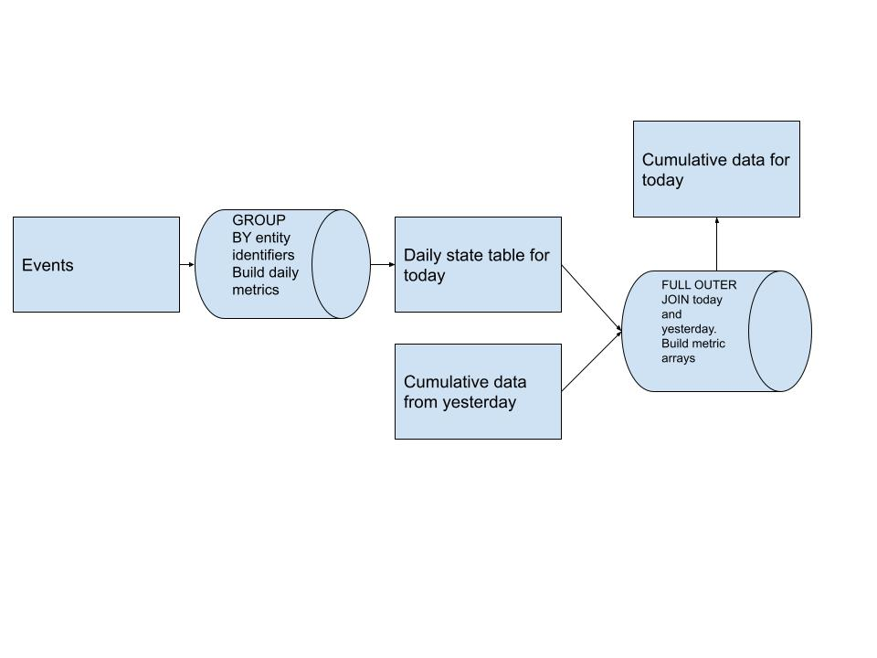

# Cumulative Table Design Example

This repo shows how to build a robust cumulative table design. 

Cumulative table design can be very useful to avoid scanning event/daily data too many times. 

> The longer the time frame of your analysis, the more critical this pattern becomes

It also gives us the ability to look at a users recent history all together in one row. 

We do this by building metric arrays *(usually of a fixed length)* where the first element in the array is the value for the current day. And the 30th element is the value 30 days ago. 

## Example Daily, Weekly, Monthly Active Users

> All query syntax is using Presto/Trino syntax and functions. This example would need to be modified for other SQL variants!

In this repo, we'll be looking into how to build this design for calculated daily, weekly and monthly active users. 
Our source table in this case is **[events](tables/events.sql)**. 
- **A user is active on any given day if they generate an event for that day.**

In this repo, we'll be using the dates 
- **2022-01-01** as **today** in Airflow terms this is `{{ ds }}`
- **2021-12-31** as **yesterday** in Airflow templating terms this is `{{ yesterday_ds}}`

This design is pretty simple with only 3 steps:

- The Daily table step
  - In this step we aggregate just the events of today to see who is daily active. The table schema is [here](tables/active_users_daily.sql)
  - This query is pretty simple and straight forward check it out[here](queries/active_users_daily_populate.sql)
    - `GROUP BY user_id` and then count them as daily active if they have any events
- The Cumulation step
  - The table schema for this step is [here](tables/active_users_cumulated.sql)
  - The query for this step is much more complex. It's [here](queries/active_users_cumulated_populate.sql)
    - This step we take **today's** data from the daily table and **yesterday's** data from the cumulated table
    - We `FULL OUTER JOIN` these two data sets on `today.user_id = yesterday.user_id`
    - If a user is brand new, they won't be in yesterday's data also if a user wasn't active today, they aren't in today's data
    - So we need to `COALESCE(today.user_id, yesterday.user_id) as user_id` to keep track of all the users
    - Next we want to build the `activity_array` column. We only want `activity_array` to store the data of the last 30 days
      - So we check to see if `CARDINALITY(activity_array) < 30` to understand if we can just add today's value to the front of the array or do we need to slice an element off the end of the array before adding today's value to the front
      - We need to perform `COALESCE(t.is_active_today, 0)` to put zero values into the array when a user isn't active
    - After we build our `activity_array`, calculating weekly and monthly activity is pretty straight forward
      - `CASE WHEN ARRAY_SUM(activity_array) > 0 THEN 1 ELSE 0 END` gives us monthly actives since we limit the array size to 30
      - `CASE WHEN ARRAY_SUM(SLICE(activity_array, 1, 7)) > 0 THEN 1 ELSE 0 END` gives us weekly active since we only check the first 7 elements of the array *(i.e. the last 7 days)*
- The DAG step
  - The example DAG can be found [here](cumulative_table_dag.py)
  - Key things to remember for the DAG are:
    - Cumulative DAGs should always be `depends_on_past: True`
    - The Daily aggregation step needs to be upstream of the cumulation step